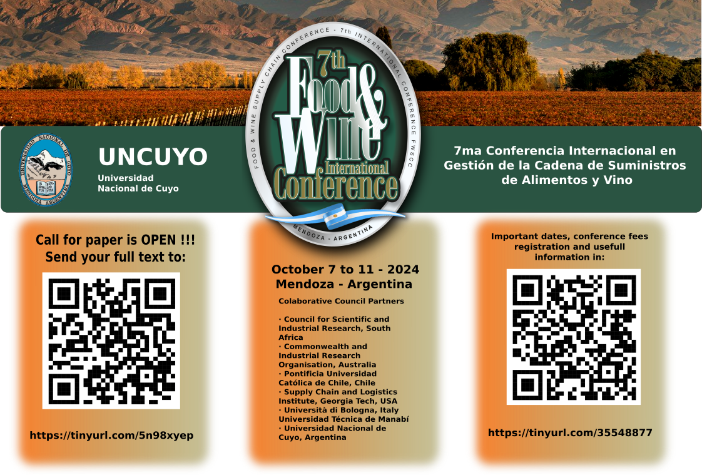

# VII Food & Wine Supply Chain Conference

## Mendoza October 7 2024

## Preface

The Universidad Nacional de Cuyo has the honor and pleasure of welcoming you to:
The 7th Food and Wine Supply Chain Conference.
As the global food and wine industries continue to evolve, specially after COVID pandemic, the intricate
network of supply chains and transportation systems that underpin them become increasingly critical. This
conference serves as a platform for industry leaders, researchers, experts, and stakeholders to convene, share
knowledge, and explore innovative solutions to the challenges and opportunities presented by this dynamic
sector.

This year’s proceedings delve into a wide range of topics, from sustainable sourcing and ethical production
to cutting-edge technologies that are revolutionizing the way food and wine are transported and distributed.
Our aim is to foster a deeper understanding of the complex interplay between supply chains, transportation,
and the overall sustainability of the food and wine industries.
We are honored to have a distinguished lineup of speakers and panelists who will share their insights and
experiences on a variety of subjects, including:

Emerging trends and technologies shaping the future of food and wine supply chains

* Sustainability initiatives and their impact on the industry
* Global challenges such as climate change, food security, and geopolitical factors Innovative
transportation solutions and their role in optimizing efficiency and reducing costs
* Case studies of successful food grow and supply chain strategies and practices

We believe that this conference will provide valuable opportunities for networking, collaboration, and
knowledge exchange. By bringing together diverse perspectives and expertise, we can collectively
address the challenges and seize the opportunities that lie ahead for the food and wine industries.
Thank you for joining us, and we look forward to a fruitful and inspiring conference.

Ricardo R. Palma - PhD
Universidad Nacional de Cuyo

Download the proceeding from this 
[link](Proceeding.pdf) 

